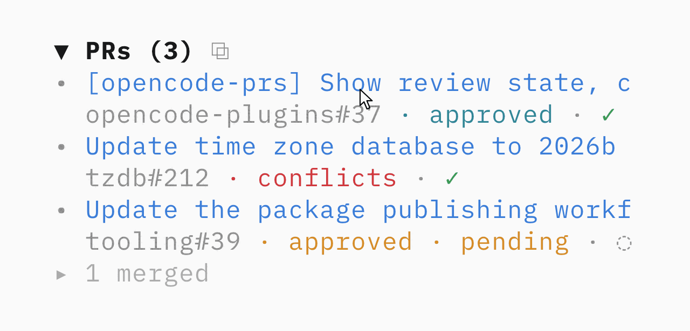

# OpenCode plugins

Small TUI plugins for [OpenCode](https://opencode.ai). Each package supports OpenCode 1 and OpenCode 2.

## Plugins

### [opencode-cost-details](packages/cost-details)

Shows the current and previous prompt-turn cost in the sidebar Context section.

<a href="packages/cost-details">
  <picture>
    <source media="(prefers-color-scheme: dark)" srcset="assets/cost-details-dark.png">
    
  </picture>
</a>

```sh
opencode2 plugin add opencode-cost-details
```

### [opencode-prs](packages/prs)

Shows GitHub pull requests opened by the current session. Every title links to GitHub.

<a href="packages/prs">
  <picture>
    <source media="(prefers-color-scheme: dark)" srcset="assets/prs-hover-dark-v6.gif">
    
  </picture>
</a>

```sh
opencode2 plugin add opencode-prs
```

See each plugin README for OpenCode 1 installation and configuration.

## Development

```sh
pnpm install
pnpm typecheck
pnpm test
```

Packages live under `packages/`. Each package builds its TypeScript and JSX into `dist/` before publishing because OpenCode loads published plugins from `node_modules`.

To use both plugins from this checkout:

```sh
pnpm dev:link
pnpm dev
```

`dev:link` configures both compiled plugin directories in `cli.json` and removes the published versions. `dev` rebuilds both plugins when their source changes. Restart the OpenCode client after a rebuild to load it.

Restore the published configuration with:

```sh
pnpm dev:unlink
```

## Releasing

Releases use [Changesets](https://changesets.dev) and npm trusted publishing. There is no npm token in the repository.

1. Run `pnpm changeset` in a feature branch and commit the generated file.
2. Merge the feature PR. CI opens or updates `release: version packages`.
3. Merge the release PR. CI publishes every changed package to npm.

Each npm package must trust the `release.yml` workflow in `vvo/opencode-plugins`.

## License

MIT
