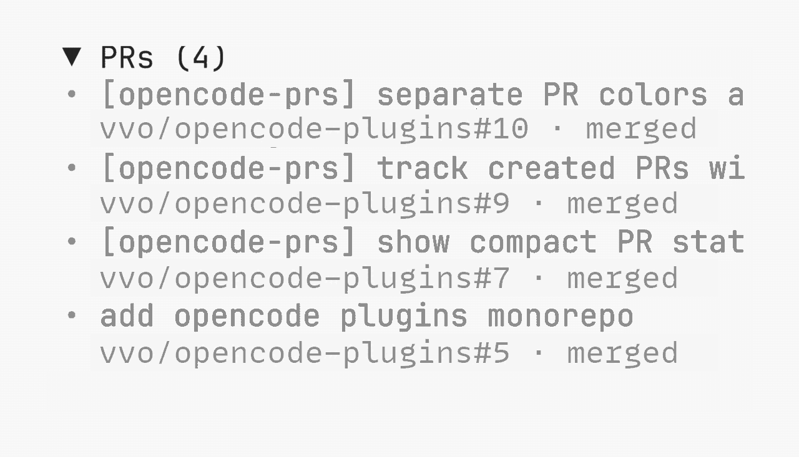

# opencode-prs

[OpenCode](https://opencode.ai) TUI plugin that lists GitHub pull requests opened by the current session.

<picture>
  <source media="(prefers-color-scheme: dark)" srcset="../../assets/prs-hover-dark-v2.gif">
  
</picture>

The sidebar section is collapsible. Each pull request uses a full-width linked title with its muted `owner/repository#number` and colored status below. Merged pull requests use subdued colors so open work stays prominent. Hover a clipped title to scroll through its full text once. Select `⧉` to copy a Slack-ready PR summary and confirm it with a toast.

## Install

OpenCode 2, in `~/.config/opencode/cli.json`:

```json
{ "plugins": ["opencode-prs"] }
```

OpenCode 1, in `~/.config/opencode/tui.json`:

```json
{ "plugin": ["opencode-prs"] }
```

Then restart OpenCode. The plugin requires an installed and authenticated [GitHub CLI](https://cli.github.com/).

## How it works

The plugin finds successful `gh pr create` calls made by the session. It asks `gh` for the current title and state. Closed pull requests are hidden, while merged pull requests remain visible. The sidebar shows up to ten pull requests, ordered by open, draft, then merged, with the newest first in each group.

Results are cached by session. Switching tabs shows the previous result immediately and revalidates GitHub data in the background. An active tab refreshes statuses every minute without replacing unchanged rows.

One published package supports OpenCode 1 and OpenCode 2.

## Development

```sh
pnpm typecheck
pnpm test
```
