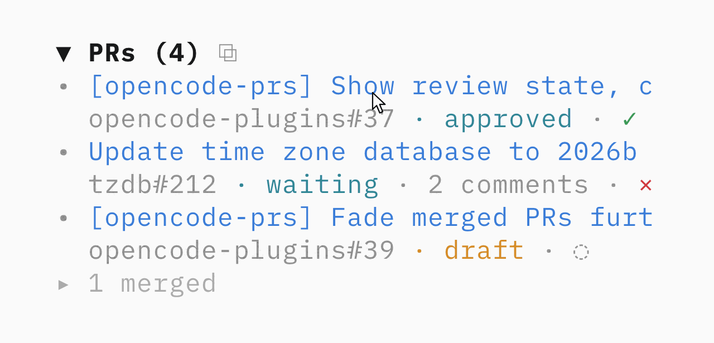

# opencode-prs

[OpenCode](https://opencode.ai) TUI plugin that lists GitHub pull requests opened by the current session.

<picture>
  <source media="(prefers-color-scheme: dark)" srcset="../../assets/prs-hover-dark-v4.gif">
  
</picture>

The sidebar section is collapsible. Each pull request uses a full-width linked title with its muted `repository#number` and colored status below: `approved` or `waiting` for open pull requests, `draft`, or `merged`. Open pull requests also show unresolved review comments and a checks indicator: `✓` passing, `×` failing, `◌` pending. Merged pull requests fold into one `▸ 3 merged` line under the open ones; click it to list them in subdued colors, so open work stays prominent. Hover a clipped title to scroll through its full text once. Click a status line to copy that PR as a Slack-ready summary, or `⧉` in the header to copy the open and draft ones, confirmed with a toast. The count in the header is the open and draft PRs too.

On opencode 2, `/prs` (or clicking the `PRs` header) opens a panel beside the conversation with every PR of the session at full width: title, `repo#number`, status, unresolved comments, diff size, and for open PRs the failing and running checks by name plus a `✓ 397 passing, 56 skipped of 462` line. Keys while the panel has focus: `j`/`k` or arrows move, `enter` or `o` opens the PR in the browser, `c` copies it for Slack, `C` copies the open and draft ones, `r` refreshes, `f` toggles full screen, `q` or `esc` closes. Clicking a row selects it, clicking a title opens it. The `▼` on the sidebar header still folds the section.

## Install

OpenCode 2, in `~/.config/opencode/cli.json`:

```json
{ "plugins": ["opencode-prs"] }
```

OpenCode 1, in `~/.config/opencode/tui.json`:

```json
{ "plugin": ["opencode-prs"] }
```

Then restart OpenCode. The plugin requires an installed and authenticated [GitHub CLI](https://cli.github.com/).

## How it works

The plugin finds successful `gh pr create` calls made by the session, plus REST fallbacks that POST to `gh api repos/<owner>/<repo>/pulls`. It fetches every pull request of a session in one GraphQL request through `gh`, and falls back to the REST API per pull request when GraphQL fails, for example when its rate limit is exhausted. Closed pull requests are hidden, while merged pull requests remain visible behind the fold. The sidebar shows up to ten pull requests, ordered by open, draft, then merged, with the newest first in each group; merged ones only take the rows the active ones leave free.

A forked session only lists pull requests created after the fork. Messages copied from the parent keep their original timestamps, so anything older than the fork itself is skipped.

Results are cached by session. Switching tabs shows the previous result immediately and revalidates GitHub data in the background. The active tab refreshes statuses every thirty seconds without replacing unchanged rows. The panel reads the same cache, so opening it costs no extra request.

Checks come from GitHub's own rollup rather than from listing every check: the rollup state gives the sidebar indicator, its per-state counts give the passing and skipped totals, and a filtered `checkRuns` query on each check suite gives the names of the failing and running ones. A vercel/api PR runs 460 checks, which would take five pages to list and still needs one number.

One published package supports OpenCode 1 and OpenCode 2.

## Development

```sh
pnpm typecheck
pnpm test
```
